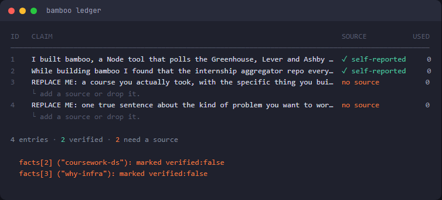
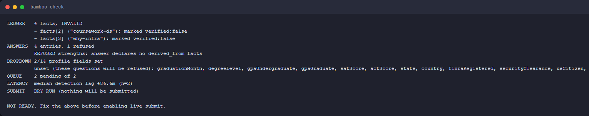
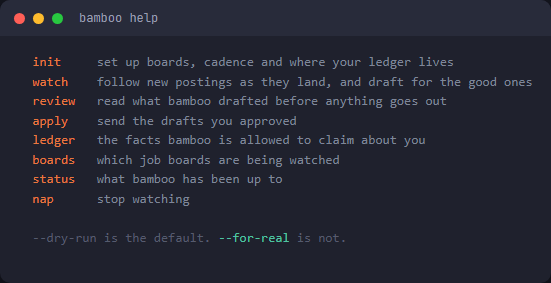

# bamboo
Watches job boards and fills internship applications from a verified evidence ledger.
Refuses to write anything it cannot trace back to a fact you checked.


## Why it works this way

Most tools in this category generate application text live, at submit time. That is the one
moment where a fabricated detail becomes permanent — in writing, under your name, at an
employer you may interview with six weeks later.

bamboo moves the writing earlier. You write your answers once, offline, and edit them until
each is true. The validator then checks that every number and proper noun in an answer
appears in the ledger facts that answer names. Apply time is pure retrieval: no model in the
hot path, nothing generated, nothing unreviewed.

The same rule covers dropdowns, which turn out to matter more. "I am authorized to work in
the United States for any employer" is a legal assertion, not a preference. It resolves from
a declared profile field or it refuses.

## How it works

**Ingestion — the aggregator is a directory, not a feed**



Mine the aggregator once for board tokens, then poll the vendors directly. Greenhouse's
`first_published` is the true posting time the aggregator does not have. The cold start
records what already exists and queues nothing, so a first run does not flood you with
8,000 stale postings.

**The refusal gate — the part that makes this different**



Five paths lead to REFUSE and one leads to a filled field. Free text must trace to a
verified fact, dropdowns must resolve from a declared profile field, custom widgets are
reported rather than faked, and file uploads are always manual. Submitting requires an
explicit opt-in; dry run is the default.

Sources are in `diagrams/*.mmd`, editable scenes in `diagrams/*.excalidraw`.

## What it looks like

The evidence ledger. Mint means a person verified it; orange means it will be refused
until you add a source.



`check` is the honest one. It tells you exactly what is blocking you, and exits non-zero
until nothing is.





These are generated, not screenshotted: `node scripts/capture-ui.js` re-renders every
image from real command output, so they cannot drift from what the CLI actually prints.

## Documentation

Full docs live in [`docs/`](docs/), organised by what you are trying to do.

| | |
|---|---|
| **New here?** | [Getting started](docs/tutorial-getting-started.md) — install to real postings in 15 min |
| **Ready to set up?** | [Write your evidence ledger](docs/howto-write-your-ledger.md) — the gating step |
| **Looking something up?** | [CLI](docs/reference-cli.md) · [Configuration](docs/reference-configuration.md) · [Data files](docs/reference-data-files.md) |
| **Wondering why?** | [Why it refuses](docs/explanation-why-it-refuses.md) · [Architecture](docs/explanation-architecture.md) · [Boundaries](docs/explanation-boundaries.md) |

## Install

Any machine with Node 22+ and access to this repo:

```bash
npm install -g github:Devin-M5706/bamboo
bamboo setup     # creates ~/.bamboo and seeds it from the bundled templates
bamboo init      # asks the questions real forms actually ask
```

`bamboo` then works from any terminal, any directory. To update, run the install again.

**Your data never lives inside the package.** Ledger, answers, config and runtime state all
live in `~/.bamboo` (override with `BAMBOO_HOME`). A global install puts the code under
`node_modules`, which npm wipes on every reinstall — a ledger stored there would vanish the
first time you upgraded. `bamboo where` prints every path.

For development, clone and `npm link` instead; edits then take effect immediately.

## Getting to your first application

```bash
bamboo setup     # once per machine
bamboo init      # boards, cadence, work authorization, graduation year
bamboo mine      # aggregator repo -> 65 board tokens
bamboo poll      # first run is a cold start: records what exists, queues nothing
bamboo survey    # what do real forms ask? run this BEFORE writing answers
bamboo check     # what is still blocking you
```

The first `poll` records every currently-live posting as already-seen (8,291 of them) so you
do not wake up to a queue full of listings from 2024. Every poll after that surfaces only
genuinely new postings.

### Write your ledger

`bamboo setup` puts starter files in `~/.bamboo`. Edit them:

```bash
bamboo where                      # shows the exact paths
# then open ~/.bamboo/ledger.json and ~/.bamboo/answers.json
```

This is the part that cannot be automated, because the entire value of the ledger is that a
person checked each entry.

- One atomic claim per fact. Not a paragraph.
- Only things you can defend in an interview.
- Every number, tool name and proper noun you want to use in an answer must appear in a
  fact's `text` or `tags`. The validator can only trace what is there.

Run `bamboo check` until nothing is refused. A refusal looks like:

```
REFUSED hardest_problem: answer contains claims not traceable to the ledger
  untraceable: Kubernetes, 90%
```

The answer claims something the ledger does not support. Fix it by adding the fact (if true)
or removing the claim (if not). Do not "fix" it by softening the wording.

### Install the extension

1. `npm run build:ext` (from a clone)
2. `chrome://extensions` → Developer mode → Load unpacked → select `extension/`
3. On the options page, paste in the contents of `~/.bamboo/ledger.json` and
   `~/.bamboo/answers.json`
4. Leave **Dry run** checked

Open any Greenhouse, Lever or Ashby application. The extension fills the form and stops.
The console (`[bamboo]`) shows what it filled and what it refused.

## Going live

Live mode submits real applications to real employers under your name. Before enabling it:

- `bamboo check` passes with zero refusals
- You have watched it dry-run at least five real forms
- You have read every answer in the bank end to end, recently

Then uncheck Dry run on the options page. It refuses to enable live mode with an empty ledger.

**Resume upload is always manual.** Browsers do not let scripts populate file inputs, and
that is a security boundary worth having.

## Commands

Installed globally as `bamboo <command>`; from a clone, `npm run <command>`.

| Command | Does |
|---|---|
| `setup` | Create `~/.bamboo`, migrate old data, seed templates. Safe to re-run |
| `where` | Print every path on this machine |
| `init` | Setup wizard: boards, cadence, work authorization, graduation year |
| `mine` | Extract board tokens from the aggregator repo |
| `poll` | One poll cycle across all boards; queues new eligible postings |
| `watch` | Poll on an interval until stopped |
| `check` | Preflight: ledger, answer traceability, dropdown fields, latency |
| `queue` | Queued postings as a list (`--all` includes handled) |
| `feed` | Queued postings as the live-feed view |
| `ledger` | The evidence ledger as a table |
| `survey` | Sample real Greenhouse forms; report which prompts recur |
| `banner` | Startup banner (needs a TTY for colour) |
| `help` | Command list |

Dev-only: `npm test` (80 tests, ~1s) and `npm run build:ext`.

`--no-color` works everywhere, as do `NO_COLOR` and piping to a non-TTY.

## Layout

```
src/
  config.js         paths, eligibility rules, polling interval, DRY_RUN_DEFAULT
  home.js           ~/.bamboo bootstrap, migration, seeding
  miner.js          aggregator repo -> board tokens
  sources.js        Greenhouse / Lever / Ashby adapters -> one Posting shape
  poll.js           poll cycle, seen-id diff, Greenhouse enrichment, apply queue
  questions.js      Greenhouse detail endpoint: descriptions + real form fields
  survey.js         aggregate what real forms ask
  eligibility.js    citizenship / sponsorship / title / deadline gates
  ledger.js         load + validate the evidence ledger
  validator.core.js trace-or-refuse for text  (NO IMPORTS — shared with the extension)
  selects.js        trace-or-refuse for dropdowns  (NO IMPORTS — shared)
  answers.js        answer bank retrieval
  ui/               theme, banner, feed, ledger table, init wizard, help
extension/          MV3 extension; content scripts fill and optionally submit
```

`validator.core.js` and `selects.js` are the single source of truth for refusal logic.
`npm run build:ext` copies them into the extension verbatim;
`test/extension-sync.test.js` fails if a copy goes stale or an import sneaks in.

## Coverage, honestly

The three polled vendors are ~30% of active listings (Ashby 13.4%, Greenhouse 11.8%, Lever
5.1%). Workday is only 6.1%. The remaining 59% is a long tail of 43 bespoke hosts,
concentrated in TikTok (34), Tesla (29), Jane Street (16) and Work at a Startup (13) — those
four are the obvious next integrations, and each needs its own form mapping.

## What measurement overturned

`bamboo survey` samples real Greenhouse forms via the detail endpoint (`?questions=true`),
which returns the actual application fields. Across 32 postings it contradicted the design's
central assumption:

**There is no recurring set of ~20 essay prompts.** Almost every free-text question appeared
exactly once, and they are logistics, not essays: visa status, current location, competing
offer deadlines, alternate email, street address. Exactly one posting in 32 asked anything
essay-shaped.

What recurs instead is dropdowns, and they are factual: work authorization (4 of 32, always
required), expected graduation year, highest degree, GPA, FINRA registration, security
clearance. So **structured facts matter more than prose** — fill your profile fields before
writing essays. The refusal machinery matters more under this finding, not less: a wrong
visa status auto-submitted is worse than a mediocre essay.

**The second finding was a live bug.** 4 of 32 sampled postings (12.5%) flipped from eligible
to ineligible once the description was fetched, all US-citizenship gates. On Rocket Lab, all
6 sampled internships require citizenship and all 6 were passing the filter. `poll` now
enriches title-eligible Greenhouse postings before deciding, and queue items carry
`eligibilityVerified` so an un-enriched posting is never mistaken for a checked one.

## Known gaps

- **`help` advertises five commands that do not exist**: `review`, `apply`, `boards`,
  `status`, `nap`. That list is the design handoff's intended surface; those are unbuilt.
- **`watch` has no interactive view.** The feed renders (`bamboo feed`), but the raw-mode
  keyboard loop — `d`/`f`/`q`, in-place status bar, clean Ctrl-C — is unwritten.
- **Nothing computes a match score.** The feed has the column and the colour thresholds;
  every score is currently `null`, which correctly prints `—` rather than a made-up number.
- **The extension has never touched a real form.** Selectors in
  `extension/content/common.js` come from public markup and are unverified.
- **Custom combobox widgets are refused, not filled.** Greenhouse and Ashby increasingly use
  React selects; faking clicks on one can leave a form looking answered while the value is
  unset, so they are reported for manual handling instead.
- Lever and Ashby expose no questions endpoint, so their forms are unmeasured.
- Board payloads are 2–6 MB each, refetched in full every cycle (~50s). Conditional requests
  would cut that substantially.
- Whether applying fast actually improves callback rates is still unmeasured. `bamboo check`
  reports median detection lag so you can eventually find out.
